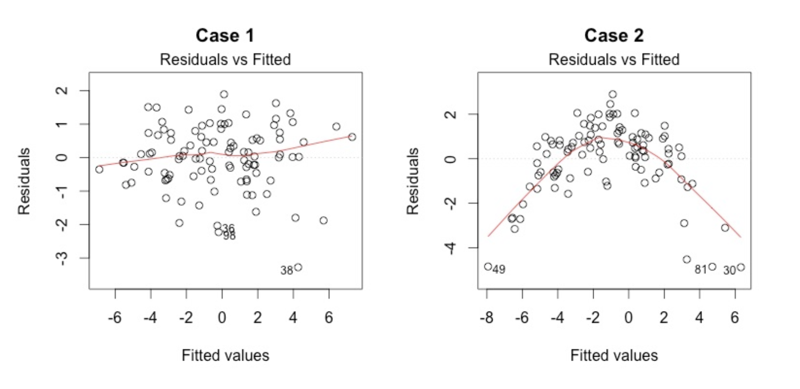
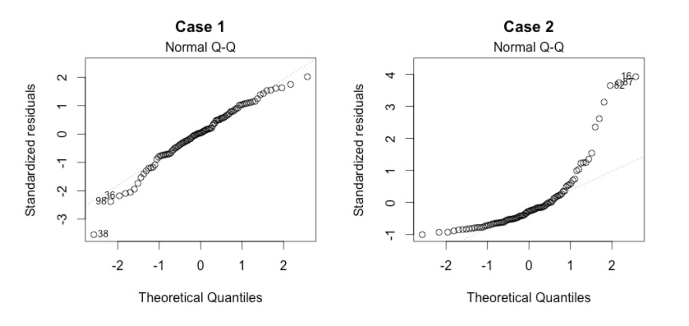
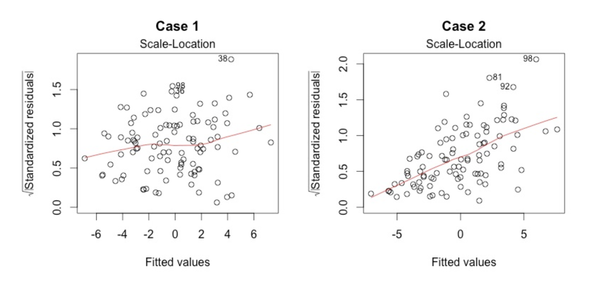

---
output:
  pdf_document: default
  html_document: default
---
# Single & Multiple Linear Regression {#mlr}

```{r message=FALSE}
library(skimr)
library(kableExtra) # for the kable_styling function

library(tibble)
library(dplyr)
library(readr)
library(ggplot2)
```


##Single variable regression

The general equation for a linear regression model

> $y^i = \beta_{0} + \beta_{1} x^i + \epsilon^i$

where:

* $y^i$ is the $i^{th}$ observation of the dependent variable
* $\beta_{0}$ is the intercept coefficient
* $\beta_{1}$ is the regression coefficient for the dependent variable
* $x^i$ is the $i^{th}$ observation of the independent variable 
* $\epsilon^i$ is the error term for the $i^{th}$ observation.  It basically is the difference in therm of y between the observed value and the estimated value.  It is also called the residuals. A good model minimize these errors. ^[Remember that the error term, $\epsilon^i$, in the simple linear regression model is independent of x, and is normally distributed, with zero mean and constant variance.]


Some ways to assess how good our model is to:

1.  compute the SSE (the sum of squared error)
    + SSE = $(\epsilon^1)^2 + (\epsilon^2)^2 + \ldots + (\epsilon^n)^2$ = $\sum_{i=1}^N \epsilon^i$
    + A good model will minimize SSE
    + problem: SSE is dependent of N.  SSE will naturally increase as N increase
2.  compute the RMSE (the root mean squared error)
    + RMSE = $\sqrt {\frac {SSE} {N}}$
    + Also a good model will minimize SSE
    + It depends of the unit of the dependent variable.  It is like the average error the model is making (in term of the unit of the dependent variable)
3.  compute $R^2$
    + It compare the models to a baseline model
    + $R^2$ is **unitless** and **universaly** interpretable
    + SST is the sum of the squared of the difference between the observed value and the mean of all the observed value
    + $R^2 = 1 - \frac {SSE} {SST}$

We usually use r-squared to check the performance of a regression.  

The conditions and assumptions to have a valid linear model are the same as for the t-test. 

* linear relationship between dependent and independent variables.  (scatterplot of dependent vs independent variables + scatterplot of residuals vs fitted).  Also check here for outliers.  Regression line and coefficient of regression are affected by outliers.  Check it would make sense to remove them.  
* Multivariate normality. Multiple regression assumes that the residuals are normally distributed.  Visual check on the Q-Q plot.  
* No Multicollinearity.  Multiple regression assumes that the independent variables are not highly correlated with each other.  Check correlation matrix and correlation plot.  This assumption can also be tested using Variance Inflation Factor (VIF) values.
* Homoscedasticity.  This assumption states that the variance of error terms are similar across the values of the independent variables.  A plot of standardized residuals versus predicted values can show whether points are equally distributed across all values of the independent variables.

In our first linear regression, we'll use the **Wine** dataset.  Let's load it and then have a quick look at its structure.
\index{skimr}
```{r linreg01, message=FALSE, warning=FALSE}
df = read_csv("dataset/Wine.csv")
skim(df)
```

We use the `lm` function to create our linear regression model.  We use *AGST* as the independent variable while the *price* is the dependent variable.
```{r linreg02-plot, echo=FALSE}
ggplot(df, aes(x = AGST, y = Price)) + geom_point()
```

We can see a weak positive correlation between `AGST` and `Price`.  The model would confirm that.  
\index{Linear model}
```{r linreg02-model}
model_lm_df = lm(Price ~ AGST, data = df)
summary(model_lm_df)
```

The `summary` function applied on the model is giving us important information.  See below for a detailed explanation of it.  

  * the stars next to the predictor variable indicated how significant the variable is for our regression model
  * it also gives us the value of the R^2 coefficient

We could have calculated the R^2 value in this way:
\index{R squared}
```{r linreg03-ssquare}
SSE = sum(model_lm_df$residuals^2)
SST = sum((df$Price - mean(df$Price))^2)
r_squared = 1 - SSE/SST
r_squared
```
The low R^2 indicate our model does not explain much of the variance of the data.  

We can now plot the observations and the line of regression; and see how the linear model fits the data.
\index{ggplot geomsmooth}
```{r linreg04-graph}
ggplot(df, aes(AGST, Price)) + 
  geom_point(shape = 1, col = "blue") + 
  geom_smooth(method = "lm", col = "red")
```
By default, the `geom_smooth()` will use a 95% confidence interval (which is the grey-er area on the graph).  There are 95% chance the line of regression will be within that zone for the whole population. 

It is always nice to see how our residuals are distributed.  
We use the `ggplot2` library and the `fortify` function which transform the `summary(model1)` into a data frame usable for plotting. 
\index{foritfy}
\index{ggplot geomhline}
\index{Residuals plot}
```{r linreg05_residuals}
model1 <- fortify(model_lm_df)
p <- ggplot(model1, aes(.fitted, .resid)) + geom_point() 
p <- p + geom_hline(yintercept = 0, col = "red", linetype = "dashed") 
p <- p + xlab("Fitted values") + ylab("Residuals") + 
  ggtitle("Plot of the residuals in function of the fitted values")
p
```

Residuals look normal: randonly scattered around the zero line.  

##Multi-variables regression

Instead of just considering one variable as predictor, we'll add a few more variables to our model with the idea to increase its predictive ability.  In our case, we are expecting an increased r-squared value.  

We have to be cautious in adding more variables.  Too many variable might give a high $R^2$ on our training data, but this not be the case as we switch to our testing data.  This is because of over-fitting and we will need to avoid this at all cost.  We'll check several ways we can use against overfitting.  

The general equations can be expressed as

> $y^i = \beta_{0} + \beta_{1} x_{1}^i + \beta_{2} x_{2}^i + \ldots + \beta_{k} x_{k}^i + \epsilon^i$

when there are k predictors variables.

There are a bit of trials and errors to make while trying to fit multiple variables into a model, but a rule of thumb would be to include most of the variable (all these that would make sense) and then take out the ones that are not very significant using the `summary(modelx)`

We are introducing 3 news libraries here besides the usual tidyverse.  
```{r message=FALSE}
library(corrr)
library(corrplot)
library(leaps)
```


### Predicting wine price (again!)
We continue here with the same dataset, *wine.csv*.  
First, we can see how each variable is correlated with each other ones.  
```{r linreg06_wine}
library(corrr)
d <- correlate(df)
d %>% shave() %>% fashion()
```

By default, R uses the Pearson coefficient of correlation.   

Multiple linear regression doesn't handle well multicollinearity.  In this case, we should remove variables that are too highly correlated.  *Age* and *Year* are too highly correlated and it should be removed.  

```{r mlr-corrplot01}
corrplot::corrplot(cor(df), type = "lower", order = "hclust", tl.col = "black", sig.level = 0.01)
```


So let's start by using all variables.  
\index{Linear model}
```{r mlr-model3}
model2_lm_df <- lm(Price ~ Year + WinterRain + AGST + HarvestRain + Age + FrancePop, data = df)
summary(model2_lm_df)
```

While doing so, we notice that the variable *Age* has NA.  This is because it is so highly correlated with the variable *year* and *FrancePop*. This came in from our correlation plot.  Also the variable *FrancePop* isn't very predictive of the price of wine.  So we can refine our models, by taking out these 2 variables, and as we'll see, it won't affect much our $R^2$ value.  Note that with multiple variables regression, it is important to look at the **Adjusted R-squared** as it take into consideration the amount of variables in the model.

```{r mlr-model3b}
model3_lm_df <- lm(Price ~ Year + WinterRain + AGST + HarvestRain, data = df)
summary(model3_lm_df)
```

We managed now to have a better r-squared than using only one predictive variable.  Also by choosing better predictive variables we managed to increase our *adjusted r-squared*.  

Although it isn't now feasible to graph in 2D the *Price* in function of the other variables, we can still graph our residuals in 2D.
\index{Residual plot}
```{r linreg07}
model3 <- fortify(model3_lm_df)
p <- ggplot(model3, aes(.fitted, .resid)) + geom_point() + 
  geom_hline(yintercept = 0, col = "red", linetype = "dashed") + xlab("Fitted values") + 
  ylab("Residuals") + 
  ggtitle("Plot of the residuals in function of the fitted values (multiple variables)")
p
```

The plot of residuals look pretty normal with points randomly scattered around the 0 line.  


## Model diagnostic and evaluation  
Let's first on onto the explanations of the summary function on the regression model.  

**Call:** 
The formula we have used for our model. 

**Coefficient – Estimate**
The coefficient Estimate is the value of the coefficient that is to be used in the equation.  The coefficients for each of the independent variable has a meaning, for example, 0.0010755 for ‘WinterRain’ means that for every 1 unit change in ‘WinterRain’, the value of ‘Price‘ increases by 0.0010755. 

**Coefficient – Standard Error** 
The coefficient Standard Error measures the average amount that the coefficient estimates vary from the actual average value of our response variable. We need this to be minimal for the variable to be able to predict accurately.

**Coefficient – t value:**
The coefficient t-value measures how many standard deviations our coefficient estimate can be far away from 0. We want this value to be high so that we can reject the null hypothesis (H0) which is ‘there is no relationship between dependent and independent variables’.

**Coefficient – Pr(>t):**
The Pr(>t) is computed from the t values. This is used for rejecting the Null Hypothesis (H00) stated above. Normally, the value for this less than 0.05 or 5% is considered to be the cut-off point for rejecting H0.

**Residuals:**
Residuals are the next component in the model summary. Residuals are the difference between the predicted values by the model and the actual values in the dataset. For the model to be good, the residuals should be normally distributed.

**Adjusted R-squared:**  
Adjusted R-squared is considered for evaluating model accuracy when the number of independent variables is greater than 1. Adjusted R-squared adjusts the number of variables considered in the model and is the preferred measure for evaluating the model goodness.

**F-Statistic:**
F-statistic is used for finding out if there exists any relationship between our independent (predictor) and the dependent (response) variables. Normally, the value of F-statistic greater than one can be used for rejecting the null hypothesis (H0: There is no relationship between Employed and other independent variables). For our model, the value of F-statistic, 330.6 is very high because of the limited data points. The p-value in the output for F-statistic is evaluated the same way we use the Pr(>t) value in the coefficients output. For the p-value, we can reject the null hypothesis (H0) as p-value < 0.05.

**There is no established relationship between the two.**
R-squared tells how much variation in the response variable is explained by the predictor variables while p-value tells if the predictors used in the model are able to explain the response variable or not. If p-value < 0.05 (for 95% confidence), then the model is considered to be good.

1.  **low R-square** and **low p-value** (p-value <= 0.05): This means that the model doesn’t explain much of the variation in the response variable, but still this is considered better than having no model to explain the response variable as it is significant as per the p-value.
2.  **low R-square** and **high p-value** (p-value > 0.05): This means that model doesn’t explain much variation in the data and is not significant. We should discard such model as this is the worst scenario.
3.  **high R-square** and **low p-value**: This means that model explains a lot of variation in the data and is also significant. This scenario is best of the four and the model is considered to be good in this case.
4.  **high R-square** and **high p-value**: This means that variance in the data is explained by the model but it is not significant. We should not use such model for predictions.


Here are the nessary conditions for a linear regression model to be valid.  Hence, these are the assumptions made when doing a linear regression. 

* **Linear Relationship**.  
The plot of the residuals should show the data points randomly scattered around the 0 line.  
This plot shows if residuals have non-linear patterns. There could be a non-linear relationship between predictor variables and an outcome variable and the pattern could show up in this plot if the model doesn’t capture the non-linear relationship. If you find equally spread residuals around a horizontal line without distinct patterns, that is a good indication you don’t have non-linear relationships.

  

There isn't any distinctive pattern in Case 1, but there is a parabola in Case 2, where the non-linear relationship was not explained by the model and was left out in the residuals.
 
*  **Multivariate normality**.  The multiple linear regression analysis requires that the errors between observed and predicted values (i.e., the residuals of the regression) should be normally distributed. This assumption may be checked by looking at a histogram or a Q-Q-Plot.  Normality can also be checked with a goodness of fit test (e.g., the Kolmogorov-Smirnov test), though this test must be conducted on the residuals themselves.  
  

* **No Multicollinearity**.  Multicollinearity may be tested with these central criteria:
1) Correlation matrix.   When computing the matrix of Pearson’s Bivariate Correlation among all independent variables the correlation coefficients need to be smaller than 1.
3) Variance Inflation Factor (VIF) – the variance inflation factor of the linear regression is defined as VIF = 1/T. Tolerance (T) is defined as T = 1 – R².  With VIF > 10 there is an indication that multicollinearity may be present; with VIF > 100 there is certainly multicollinearity among the variables.
If multicollinearity is found in the data, centering the data (that is deducting the mean of the variable from each score) might help to solve the problem.  However, the simplest way to address the problem is to remove independent variables with high VIF values.

* **Homoscedasticity**.  A scatterplot of residuals versus predicted values is good way to check for homoscedasticity.  There should be no clear pattern in the distribution; if there is a cone-shaped pattern (as shown below), the data is heteroscedastic.
If the data are heteroscedastic, a non-linear data transformation or addition of a quadratic term might fix the problem.

This plot shows if residuals are spread equally along the ranges of predictors. This is how you can check the assumption of equal variance (homoscedasticity). It’s good if you see a horizontal line with equally (randomly) spread points.  
  

In Case 2, the residuals begin to spread wider along the x-axis. Because the residuals spread wider and wider, the red smooth line is not horizontal and shows a steep angle in Case 2.


## Final example - Boston dataset - with backward elimination  
On this last example we'll use a more systemic way to find out which variables should be chosen into our models.  
```{r linreg07b, message=FALSE}
df <- read_csv("dataset/Boston.csv")
skimr::skim(df)
```

Here is the list of variables with their meaning. 
 
 * CRIM     per capita crime rate by town
 * ZN       proportion of residential land zoned for lots over 25,000 sq.ft.
 * INDUS    proportion of non-retail business acres per town
 * CHAS     Charles River dummy variable (= 1 if tract bounds river; 0 otherwise)
 * NOX      nitric oxides concentration (parts per 10 million)
 * RM       average number of rooms per dwelling
 * AGE      proportion of owner-occupied units built prior to 1940
 * DIS      weighted distances to five Boston employment centres
 * RAD      index of accessibility to radial highways
 * TAX      full-value property-tax rate per $10,000
 * PTRATIO  pupil-teacher ratio by town
 * B        1000(Bk - 0.63)^2 where Bk is the proportion of blacks by town
 * LSTAT    % lower status of the population
 * MEDV     Median value of owner-occupied homes in $1000's
 
Let's make the necessary adjustment in variable types
```{r linreg08}
df$CHAS <- factor(df$CHAS)
```

A quick check on how correlated are our variables.
```{r linreg09}
corrplot(cor(df %>% select(-CHAS)), type = "lower", order = "hclust", tl.col = "black", sig.level = 0.01)
correlate(df %>% select(-CHAS)) %>% shave() %>% fashion()
```


```{r linreg10}
yo <- correlate(df %>% select(-CHAS)) %>% shave() %>% fashion()
kable(yo, format = "html") %>% kable_styling()
```


```{r linreg11}
model_mlr_df <- lm(MEDV ~ ., data = df)
model_bwe_df <- regsubsets(formula(model_mlr_df), data = df, method = "backward")
summary(model_mlr_df)

plot(model_bwe_df, scale = "adjr2")
```


Ideally, the model should consider the following variables
```{r linreg12}
model2_mlr_df <- lm(MEDV ~ CRIM + NOX + RM + DIS + RAD + PTRATIO + BLACK + LSTAT, data = df)
summary(model2_mlr_df)
```

### Model diagmostic  
To check that we have a linear relationship between the numerical explanatory variables and the response variable, we create a scatter plot with the variable and the residuals

```{r linreg13}
df2 <- tibble(x = df$MEDV, residuals = model2_mlr_df$residuals, fitted = model2_mlr_df$fitted.values)
ggplot(df2, aes(x = x, y = residuals)) + 
  geom_jitter()


```

```{r linreg14}
ggplot(df2, aes(x = fitted, y = residuals)) + 
  geom_jitter()
```


```{r linreg15}
library(ggfortify)
autoplot(model2_mlr_df)
```

## References  

* On the difference between the p-values of the F statistics and the R^2.  [Here](https://analyticsdefined.com/interpreting-linear-regression-in-r/)  
* On the diagnotic plots and interpretation of results. [Here](http://data.library.virginia.edu/diagnostic-plots/) and [here](http://www.statisticssolutions.com/assumptions-of-multiple-linear-regression/)

