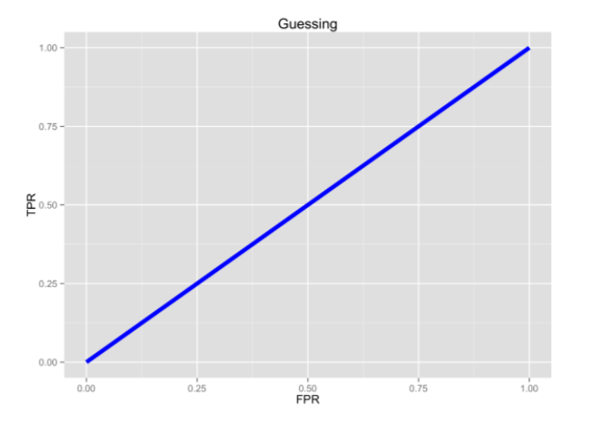

# Logistic Regression {#logistic}

## Introduction
Logistic Regression is a classification algorithm. It is used to predict a binary outcome (1 / 0, Yes / No, True / False) given a set of independent variables. To represent binary / categorical outcome, we use dummy variables. You can also think of logistic regression as a special case of linear regression when the outcome variable is categorical, where we are using log of odds as dependent variable. In simple words, it predicts the probability of occurrence of an event by fitting data to a logit function.  
Logistic Regression is part of a larger class of algorithms known as Generalized Linear Model (glm).  
Although most logisitc regression should be called **binomial logistic regression**, since the variable to predict is binary, however, logistic regression can also be used to predict a dependent variable which can assume more than 2 values. In this second case we call the model **multinomial logistic regression**. A typical example for instance, would be classifying films between “Entertaining”, “borderline” or “boring”.

## The logistic equation.  
The general equation of the **logit model**  

$$\mathbf{Y} = \beta_0 + \beta_1  x_1 + \beta_2 x_2 + ... + \beta_n x_n$$
where **Y** is the variable to predict.   
$\beta$ is the coefficients of the predictors and the $x_i$ are the predictors (aka independent variables).  
In logistic regression, we are only concerned about the probability of outcome dependent variable ( success or failure).  We should then rewrite our function  
$$p = e^{(\beta_0 + \beta_1 x_1 + \beta_2 x_2 + ... + \beta_n x_n)}$$.   
This however does not garantee to have p between 0 and 1.  
Let's then have 
$$p = \frac{e^{(\beta_0 + \beta_1 x_1 + \beta_2 x_2 + ... + \beta_n x_n)}} {e^{(\beta_0 + \beta_1 x_1 + \beta_2 x_2 + ... + \beta_n x_n)} + 1}$$  
or 
$$p = \frac {e^Y} {e^Y + 1}$$   
where *p* is the probability of success.  With little further manipulations, we have 
$$\frac {p} {1-p} = e^Y$$ and $$\log{\frac{p} {1-p}} = Y$$   
If we remember what was **Y**, we get 
$$\log{\dfrac{p} {1-p}} = \beta_0 + \beta_1  x_1 + \beta_2 x_2 + ... + \beta_n x_n$$  

This is the equation used in Logistic Regression. Here (p/1-p) is the odd ratio. Whenever the log of odd ratio is found to be positive, the probability of success is always more than 50%.  

##  Performance of Logistic Regression Model   
To evaluate the performance of a logistic regression model, we can consider a few metrics.  

* **AIC (Akaike Information Criteria)** The analogous metric of adjusted R-squared in logistic regression is AIC. AIC is the measure of fit which penalizes model for the number of model coefficients. Therefore, we always prefer model with minimum AIC value.  
* **Null Deviance and Residual Deviance** Null Deviance indicates the response predicted by a model with nothing but an intercept. Lower the value, better the model. Residual deviance indicates the response predicted by a model on adding independent variables. Lower the value, better the model.  
* **Confusion Matrix** It is nothing but a tabular representation of Actual vs Predicted values. This helps us to find the accuracy of the model and avoid overfitting.  
* We can calcualate the accuracy of our model by $$\frac {True Positives + True Negatives}{True Positives + True Negatives + False Positives + False Negatives}$$  
* From confusion matrix, **Specificity** and **Sensitivity** can be derived as $$Specificity = \frac {True Negatives} {True Negative + False Positive}$$ and $$Sensitivity = \frac{True Positive}{True Positive + False Negative}$$  
* **ROC Curve** Receiver Operating Characteristic(ROC) summarizes the model’s performance by evaluating the trade offs between true positive rate (sensitivity) and false positive rate(1- specificity). For plotting ROC, it is advisable to assume p > 0.5 since we are more concerned about success rate. ROC summarizes the predictive power for all possible values of p > 0.5.  The area under curve (AUC), referred to as index of accuracy(A) or concordance index, is a perfect performance metric for ROC curve. Higher the area under curve, better the prediction power of the model. The ROC of a perfect predictive model has TP equals 1 and FP equals 0. This curve will touch the top left corner of the graph.

## Setting up  
As usual we will use the `tidyverse` and `caret` package
```{r message=FALSE, warning=FALSE}
library(caret)      # For confusion matrix
library(ROCR)       # For the ROC curve
```

We can now get straight to business and see how to model logisitc regression with R and then have the more interesting discussion on its performance.   

## Example 1 - Graduate Admission   
We use a dataset about factors influencing graduate admission that can be downloaded from the [UCLA Institute for Digital Research and Education](http://www.ats.ucla.edu/stat/data/binary.csv)  

The dataset has 4 variables  

* `admit` is the response variable  
* `gre` is the result of a standardized test  
* `gpa` is the result of the student GPA (school reported)
* `rank` is the type of university the student apply for (4 = Ivy League, 1 = lower level entry U.)  

Let's have a quick look at the data and their summary.  The goal is to get familiar with the data, type of predictors (continuous, discrete, categorical, etc.) 

```{r echo=TRUE, warning=FALSE, message=FALSE}
df <- read_csv("dataset/grad_admission.csv")
glimpse(df)

#Quick check to see if our response variable is balanced-ish
table(df$admit)
```
Well that's not a very balanced response variable, although it is not hugely unbalanced either as it can be the cases sometimes in medical research. 

```{r}
## Two-way contingency table of categorical outcome and predictors
round(prop.table(table(df$admit, df$rank), 2), 2)
```
It seems about right ... most students applying to Ivy Leagues graduate programs are not being admitted.  

Before we can run our model, let's transform the `rank` explanatory variable to a factor. 
```{r warning=FALSE, message=FALSE}
df2 <- df
df2$rank <- factor(df2$rank)

# Run the model
model_lgr_df2 <- glm(admit ~ ., data = df2, family = "binomial")
summary(model_lgr_df2)
```

The next part of the output shows the coefficients, their standard errors, the z-statistic (sometimes called a Wald z-statistic), and the associated p-values. Both gre and gpa are statistically significant, as are the three terms for rank. The logistic regression coefficients give the change in the log odds of the outcome for a one unit increase in the predictor variable.  
For every one unit change in `gre`, the log odds of admission (versus non-admission) increases by 0.002.  
For a one unit increase in `gpa`, the log odds of being admitted to graduate school increases by 0.804.  
The indicator variables for `rank` have a slightly different interpretation. For example, having attended an undergraduate institution with rank of 2, versus an institution with a rank of 1, changes the log odds of admission by -0.675.  

To see how the variables in the model participates in the decrease of *Residual Deviance*, we can use the `ANOVA` function on our model. 
```{r}
anova(model_lgr_df2)
```

We can test for an overall effect of `rank` (its significance) using the `wald.test function` of the `aod` library. The order in which the coefficients are given in the table of coefficients is the same as the order of the terms in the model. This is important because the wald.test function refers to the coefficients by their order in the model. We use the wald.test function. `b` supplies the coefficients, while `Sigma` supplies the variance covariance matrix of the error terms, finally `Terms` tells R which terms in the model are to be tested, in this case, terms 4, 5, and 6, are the three terms for the levels of `rank`.  
```{r echo=TRUE}
library(aod)
wald.test(Sigma = vcov(model_lgr_df2), b = coef(model_lgr_df2), Terms = 4:6)
```
The chi-squared test statistic of 20.9, with three degrees of freedom is associated with a p-value of 0.00011 indicating that the overall effect of rank is statistically significant.

Let's check how our model is performing.  As mentioned earlier, we need to make a choice on the cutoff value (returned probability) to check our accuracy.  In this first example, let's just stick with the usual `0.5` cutoff value.  
```{r}
prediction_lgr_df2 <- predict(model_lgr_df2, data = df2, type = "response")
head(prediction_lgr_df2, 10)
```
As it stands, the `predict` function gives us the probabilty that the observation has a response of 1; in our case, the probability that a student is being admitted into the graduate program.   
To check the accuracy of the model, we need a confusion matrix with a cut off value.  So let's clean that vector of probability.  

```{r}
prediction_lgr_df2 <- if_else(prediction_lgr_df2 > 0.5 , 1, 0)
confusionMatrix(data = factor(prediction_lgr_df2), 
                reference = factor(df2$admit), positive = "1")
```

We have an interesting situation here.  Although all our variables were significant in our model, the accuracy of our model, `71%` is just a little bit higher than the basic benchmark which is the no-information model (ie. we just predict the highest class) in this case `68.25%`.  

Before we do a ROC curve, let's have a quick reminder on ROC.   
ROC are plotting the proprotion of TP to FP.  So ideally we want to have 100% TP and 0% FP.   
  

Pure Random guessing should lead to this curve   


With that in mind, let's do a ROC curve on out model
```{r roc_admission_pic1}
prediction_lgr_df2 <- predict(model_lgr_df2, data = df2, type="response")
pr_admission <- prediction(prediction_lgr_df2, df2$admit)
prf_admission <- performance(pr_admission, measure = "tpr", x.measure = "fpr")
plot(prf_admission, colorize = TRUE, lwd=3)
```

At least it is better than just random guessing.  

In some applications of ROC curves, you want the point closest to the TPR of \(1\) and FPR of \(0\). This cut point is “optimal” in the sense it weighs both sensitivity and specificity equally.
Now, there is a cost measure in the ROCR package that you can use to create a performance object. Use it to find the cutoff with minimum cost.    
```{r}
cost_admission_perf = performance(pr_admission, "cost")
cutoff <- pr_admission@cutoffs[[1]][which.min(cost_admission_perf@y.values[[1]])]
```

Using that cutoff value we should get our sensitivity and specificity a bit more in balance. 
Let's try
```{r}
prediction_lgr_df2 <- predict(model_lgr_df2, data = df2, type = "response")
prediction_lgr_df2 <- if_else(prediction_lgr_df2 > cutoff , 1, 0)
confusionMatrix(data = factor(prediction_lgr_df2), 
                reference = factor(df2$admit), 
                positive = "1")
```

And bonus, we even gained some accuracy!  
  
I have seen a very cool graph on [this website](http://ethen8181.github.io/machine-learning/unbalanced/unbalanced.html) that plots this tradeoff between specificity and sensitivity and shows how this cutoff point can enhance the understanding of the predictive power of our model. 
```{r confusion_plot1}
# Create tibble with both prediction and actual value
cutoff = 0.487194
cutoff_plot <- tibble(predicted = predict(model_lgr_df2, data = df2, type = "response"), 
                      actual = as.factor(df2$admit)) %>% 
                 mutate(type = if_else(predicted >= cutoff & actual == 1, "TP", 
                        if_else(predicted >= cutoff & actual == 0, "FP", 
                                if_else(predicted < cutoff & actual == 0, "TN", "FN"))))

cutoff_plot$type <- as.factor(cutoff_plot$type)

ggplot(cutoff_plot, aes(x = actual, y = predicted, color = type)) + 
  geom_violin(fill = "white", color = NA) + 
  geom_jitter(shape = 1) + 
  geom_hline(yintercept = cutoff, color = "blue", alpha = 0.5) + 
  scale_y_continuous(limits = c(0, 1)) + 
  ggtitle(paste0("Confusion Matrix with cutoff at ", cutoff))
```

Last thing ... the AUC, aka *Area Under the Curve*.  
The AUC is basically the area under the ROC curve.  
You can think of the AUC as sort of a holistic number that represents how well your TP and FP is looking in aggregate.

AUC=0.5 -> BAD  

AUC=1 -> GOOD


So in the context of an ROC curve, the more "up and left" it looks, the larger the AUC will be and thus, the better your classifier is. Comparing AUC values is also really useful when comparing different models, as we can select the model with the high AUC value, rather than just look at the curves.

In our situation with our model `model_admission_lr`, we can find our AUC with the `ROCR` package.  
```{r}
prediction_lgr_df2 <- predict(model_lgr_df2, data = df2, type="response")
pr_admission <- prediction(prediction_lgr_df2, df2$admit)
auc_admission <- performance(pr_admission, measure = "auc")

# and to get the exact value  
auc_admission@y.values[[1]]
```

## Example 2 - Diabetes  
In our second example we will use the *Pima Indians Diabetes Data Set* that can be downloaded on the [UCI Machine learning website](https://archive.ics.uci.edu/ml/datasets/Pima+Indians+Diabetes).  
We are also dropping a clean version of the file as .csv on our github dataset folder.  

The data set records females patients of at least 21 years old of Pima Indian heritage.  
```{r message=FALSE}
df <- read_csv("dataset/diabetes.csv")
```

The dataset has `r nrow(df)` observations and `r ncol(df)` variables.  

Let's rename our variables with the proper names. 
```{r}
colnames(df) <- c("pregnant", "glucose", "diastolic", 
                  "triceps", "insulin", "bmi", "diabetes", "age", 
                  "test")
glimpse(df)
```

All variables seems to have been recorded with the appropriate type in the data frame.  Let's just change the type of the response variable to factor with *positive* and *negative* levels.  
```{r}
df$test <- factor(df$test)
#levels(df$output) <- c("negative", "positive")
```

Let's do our regression on the whole dataset.  
```{r}
df2 <- df
model_lgr_df2 <- glm(test ~., data = df2, family = "binomial")
summary(model_lgr_df2)
```

If we look at the z-statistic and the associated p-values, we can see that the variables `triceps`, `insulin` and `age` are not significant variables. 

The logistic regression coefficients give the change in the log odds of the outcome for a one unit increase in the predictor variable.  Hence, everything else being equals, any additional pregnancy increase the log odds of having diabetes (class_variable = 1) by another `0.1231`.   

We can see the confidence interval for each variables using the `confint` function.  
```{r}
confint(model_lgr_df2)
```

If we want to get the odds, we basically exponentiate the coefficients.  
```{r}
exp(coef(model_lgr_df2))
```

In this way, for every additional year of age, the odds of getting diabetes (test = positive) is increasing by `1.015`.   

Let's have a first look at how our model perform
```{r}
prediction_lgr_df2 <- predict(model_lgr_df2, data = df2, type="response")
prediction_lgr_df2 <- if_else(prediction_lgr_df2 > 0.5, 1, 0)
#prediction_diabetes_lr <- factor(prediction_diabetes_lr)
#levels(prediction_diabetes_lr) <- c("negative", "positive")

table(df2$test)

confusionMatrix(data = factor(prediction_lgr_df2), 
                reference = factor(df2$test), 
                positive = "1")

```

Let's create our ROC curve
```{r roc_diabetes_pic1}
prediction_lgr_df2 <- predict(model_lgr_df2, data = df2, type="response")
pr_diabetes <- prediction(prediction_lgr_df2, df2$test)
prf_diabetes <- performance(pr_diabetes, measure = "tpr", x.measure = "fpr")
plot(prf_diabetes, colorize = TRUE, lwd = 3)
```


Let's find the best cutoff value for our model.  
```{r}
cost_diabetes_perf = performance(pr_diabetes, "cost")
cutoff <- pr_diabetes@cutoffs[[1]][which.min(cost_diabetes_perf@y.values[[1]])]
```

Instead of redoing the whole violin-jitter graph for our model, let's create a function so we can reuse it at a later stage.  
```{r confusion_plot2}
violin_jitter_graph <- function(cutoff, df_predicted, df_actual){
  cutoff_tibble <- tibble(predicted = df_predicted, actual = as.factor(df_actual)) %>% 
                 mutate(type = if_else(predicted >= cutoff & actual == 1, "TP", 
                                       if_else(predicted >= cutoff & actual == 0, "FP", 
                                               if_else(predicted < cutoff & actual == 0, "TN", "FN"))))
  cutoff_tibble$type <- as.factor(cutoff_tibble$type)
  
  ggplot(cutoff_tibble, aes(x = actual, y = predicted, color = type)) + 
    geom_violin(fill = "white", color = NA) + 
    geom_jitter(shape = 1) + 
    geom_hline(yintercept = cutoff, color = "blue", alpha = 0.5) + 
    scale_y_continuous(limits = c(0, 1)) + 
    ggtitle(paste0("Confusion Matrix with cutoff at ", cutoff))
}


violin_jitter_graph(cutoff, predict(model_lgr_df2, data = df2, type = "response"), df2$test)
```

The accuracy of our model is slightly improved by using that new cutoff value.  

### Accounting for missing values  
The UCI Machine Learning website note that there are no missing values on this dataset.  That said, we have to be careful as there are many 0, when it is actually impossible to have such 0.  
So before we keep going let's fill in these values.  

The first thing to to is to change these `0` into `NA`.  
```{r}
df3 <- df2

#TODO Find a way to create a function and use map from purrr to do this
df3$glucose[df3$glucose == 0] <- NA
df3$diastolic[df3$diastolic == 0] <- NA
df3$triceps[df3$triceps == 0] <- NA
df3$insulin[df3$insulin == 0] <- NA
df3$bmi[df3$bmi == 0] <- NA
```

```{r missingdata_pic1, message=FALSE, warning=FALSE}
library(visdat)
vis_dat(df3)
```

There are a lot of missing values ... too many of them really.  If this was really life, it would be important to go back to the drawing board and redisigning the data collection phase.  

```{r}
model_lgr_df3 <- glm(test ~., data = df3, family = "binomial")
summary(model_lgr_df3)
```

This leads to a very different results than previously.  

Let's have a look at this new model performance  
```{r}
prediction_lgr_df3 <- predict(model_lgr_df3, data = df3, type="response")
prediction_lgr_df3 <- if_else(prediction_lgr_df3 > 0.5, 1, 0)
#prediction_diabetes_lr <- factor(prediction_diabetes_lr)
#levels(prediction_diabetes_lr) <- c("negative", "positive")

table(df3$test)

#confusionMatrix(data = prediction_diabetes_lr2, 
#                reference = df2$test, 
#                positive = "1")

```

### Imputting Missing Values 

Now let's impute the missing values using the `simputatiion` package.  A nice vignette is available [here](https://cran.r-project.org/web/packages/simputation/vignettes/intro.html).  

```{r}
library(simputation)
df4 <- df3
df4 <- impute_lm(df3, formula = glucose ~ pregnant + diabetes + age | test)
df4 <- impute_rf(df4, formula = bmi ~ glucose + pregnant + diabetes + age | test)
df4 <- impute_rf(df4, formula = diastolic ~ bmi + glucose + pregnant + diabetes + age | test)
df4 <- impute_en(df4, formula = triceps ~ pregnant + bmi + diabetes + age | test)
df4 <- impute_rf(df4, formula = insulin ~ . | test)

summary(df4)
```

Ok we managed to get rid of the NAs.  Let's run a last time our logistic model. 
```{r}
model_lgr_df4 <- glm(test ~ ., data = df4, family = "binomial")
summary(model_lgr_df4)
```

```{r}
prediction_lgr_df4 <- predict(model_lgr_df4, data = df4, type="response")
prediction_lgr_df4 <- if_else(prediction_lgr_df4 > 0.5, "positive", "negative")
prediction_lgr_df4 <- factor(prediction_lgr_df4)
levels(prediction_lgr_df4) <- c("negative", "positive")

#table(df4$test, prediction_lgr_df4)
#table(df4$test)
########

#confusionMatrix(data = accuracy_model_lr3, 
#                reference = df3$test, 
#                positive = "positive")
```

### ROC and AUC
```{r roc_model3_pic1}
prediction_lgr_df4 <- predict(model_lgr_df4, data = df4, type="response")
#pr <- prediction(prediction_lgr_df4, df4$test)
#prf <- performance(pr, measure = "tpr", x.measure = "fpr")
#plot(prf)

```


Let's go back to the ideal cut off point that would balance the sensitivity and specificity. 
```{r}
#cost_diabetes_perf <- performance(pr, "cost")
#cutoff <- pr@cutoffs[[1]][which.min(cost_diabetes_perf@y.values[[1]])]
```

So for maximum accuracy, the ideal cutoff point is `0.487194`.  
Let's redo our confusion matrix then and see some improvement.  
```{r}
prediction_lgr_df4 <- predict(model_lgr_df4, data = df4, type="response")
prediction_lgr_df4 <- if_else(prediction_lgr_df4 >= cutoff, "positive", "negative")

#confusionMatrix(data = accuracy_model_lr3, 
#                reference = df3$test, 
#                positive = "positive")
```


Another cost measure that is popular is overall accuracy. This measure optimizes the correct results, but may be skewed if there are many more negatives than positives, or vice versa. Let's get the overall accuracy for the simple predictions and plot it.

Actually the `ROCR` package can also give us a plot of accuracy for various cutoff points
```{r roc_model3_pic2}
#prediction_lgr_df4 <- performance(pr, measure = "acc")
#plot(prediction_lgr_df4)
```


Often in medical research for instance, there is a cost in having false negative is quite higher than a false positve.  
Let's say the cost of missing someone having diabetes is 3 times the cost of telling someone that he has diabetes when in reality he/she doesn't.  
```{r}
#cost_diabetes_perf <- performance(pr, "cost", cost.fp = 1, cost.fn = 3)
#cutoff <- pr@cutoffs[[1]][which.min(cost_diabetes_perf@y.values[[1]])]
```

Lastly, in regards to AUC
```{r}
#auc <- performance(pr, measure = "auc")
#auc <- auc@y.values[[1]]
#auc
```


## References  

* The Introduction is from the [AV website](https://www.analyticsvidhya.com/blog/2015/11/beginners-guide-on-logistic-regression-in-r/?utm_content=buffer43450&utm_medium=social&utm_source=linkedin.com&utm_campaign=buffer)  

* Confusion plot.  The [webpage](http://ethen8181.github.io/machine-learning/unbalanced/unbalanced.html) and the [code](https://github.com/ethen8181/machine-learning/blob/master/unbalanced/unbalanced_code/unbalanced_functions.R)

* The [UCLA Institute for Digital Research and Education](http://www.ats.ucla.edu/stat/data/binary.csv) site where we got the dataset for our first example

* The [UCI Machine learning](https://archive.ics.uci.edu/ml/datasets/Pima+Indians+Diabetes) site where we got the dataset for our second example
* Function to use ROC with ggplot2 - [The Joy of Data](http://www.joyofdata.de/blog/illustrated-guide-to-roc-and-auc/) and [here as well](https://github.com/joyofdata/joyofdata-articles/tree/master/roc-auc)
