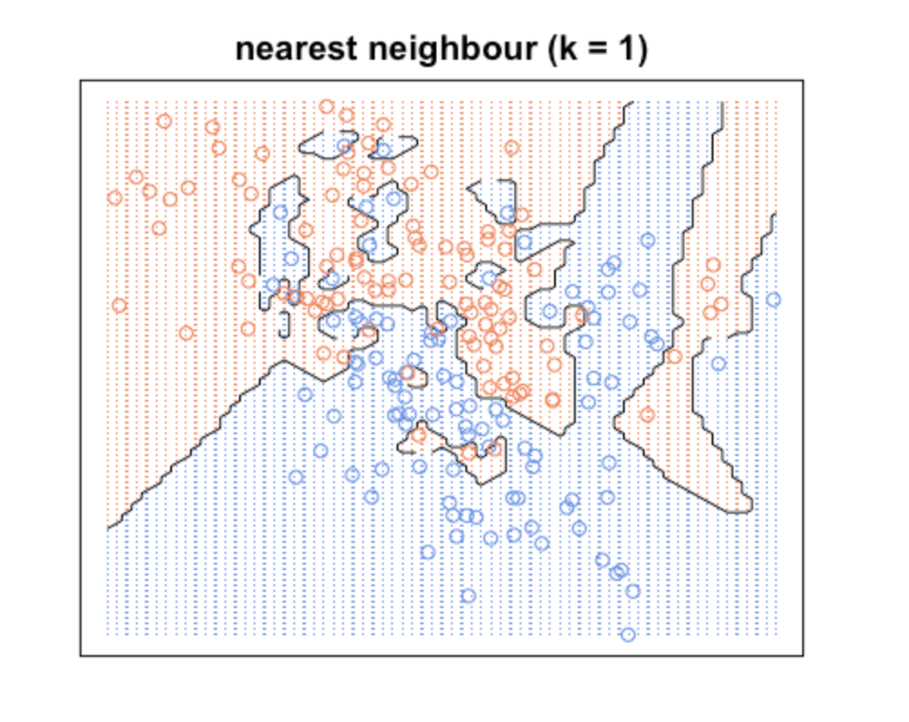
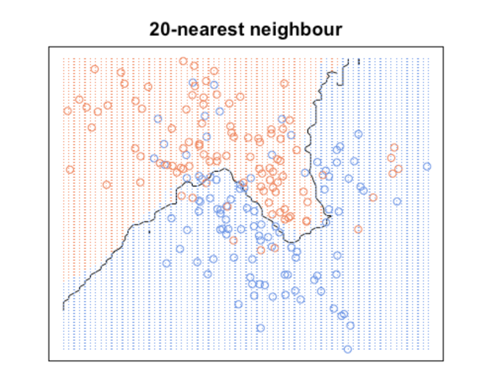

# KNN - K Nearest Neighbour {#knnchapter}

The KNN algorithm is a robust and versatile classifier that is often used as a benchmark for more complex classifiers such as Artificial Neural Networks (ANN) and Support Vector Machines (SVM). Despite its simplicity, KNN can outperform more powerful classifiers and is used in a variety of applications.  

The KNN classifier is also a non parametric and instance-based learning algorithm.

**Non-parametric** means it makes no explicit assumptions about the functional form of h, avoiding the dangers of mismodeling the underlying distribution of the data. For example, suppose our data is highly non-Gaussian but the learning model we choose assumes a Gaussian form. In that case, our algorithm would make extremely poor predictions.  

**Instance-based** learning means that our algorithm doesn’t explicitly learn a model (lazy learner). Instead, it chooses to memorize the training instances which are subsequently used as “knowledge” for the prediction phase. Concretely, this means that only when a query to our database is made (i.e. when we ask it to predict a label given an input), will the algorithm use the training instances to spit out an answer.

It is worth noting that the minimal training phase of KNN comes both at a memory cost, since we must store a potentially huge data set, as well as a computational cost during test time since classifying a given observation requires a run down of the whole data set. Practically speaking, this is undesirable since we usually want fast responses.

The principle behind KNN classifier (K-Nearest Neighbor) algorithm is to find K predefined number of training samples that are closest in the distance to a new point & predict a label for our new point using these samples.

When K is small, we are restraining the region of a given prediction and forcing our classifier to be “more blind” to the overall distribution. A small value for K provides the most flexible fit, which will have low bias but high variance. Graphically, our decision boundary will be more jagged.



On the other hand, a higher K averages more voters in each prediction and hence is more resilient to outliers. Larger values of K will have smoother decision boundaries which means lower variance but increased bias.



What we are observing here is that increasing k will decrease variance and increase bias. While decreasing k will increase variance and decrease bias. Take a look at how variable the predictions are for different data sets at low k. As k increases this variability is reduced. But if we increase k too much, then we no longer follow the true boundary line and we observe high bias. This is the nature of the Bias-Variance Tradeoff.  

## Example 1.  Prostate Cancer dataset  
\index{Prostate cancer dataset}

```{r knn01, message=FALSE, warning=FALSE}
library(tidyverse)
df <- read_csv("dataset/prostate_cancer.csv")
glimpse(df)
```

Change the diagnosis result into a factor, then remove the `ID` variable as it does not bring anything. 
```{r knn02}
df$diagnosis_result <- factor(df$diagnosis_result, levels = c("B", "M"), 
                               labels = c("Benign", "Malignant"))
df2 <- df %>% select(-id)

# Checking how balance is the dependend variable 
prop.table(table(df2$diagnosis_result))
```

It is quite typical of such medical dataset to be unbalanced.  We'll have to deal with it.  

Like with PCA, KNN is quite sensitve to the scale of the variable.  So it is important to first standardize the variables. This time we'll do this using the `preProcess` funnction of the `caret` package.  
\index{Normalisation}
\index{caret}
```{r kn03, message=FALSE, warning=FALSE}
library(caret)
param_preproc_df2 <- preProcess(df2[,2:9], method = c("scale", "center"))
df3_stdize <- predict(param_preproc_df2, df2[, 2:9])

summary(df3_stdize)
```

We can now see that all means are centered around 0.  Now we reconstruct our df with the response variable and we split the df into a training and testing set.  
\index{Splitting dataset}
```{r}
df3_stdize <- bind_cols(diagnosis = df2$diagnosis_result, df3_stdize)

param_split<- createDataPartition(df3_stdize$diagnosis, times = 1, p = 0.8, 
                                      list = FALSE)
train_df3 <- df3_stdize[param_split, ]
test_df3 <- df3_stdize[-param_split, ]

#We can check that we still have the same kind of split
prop.table(table(train_df3$diagnosis))
```

Nice to see that the proportion of *Malign* vs *Benin* has been conserved.  
\index{KNN}
\index{Cross validation}
We use KNN with cross-validation (discussed in more details in this section \@ref(crossvalidation) to train our model.  
```{r knn04}
trnctrl_df3 <- trainControl(method = "cv", number = 10)
model_knn_df3 <- train(diagnosis ~., data = train_df3, method = "knn", 
                       trControl = trnctrl_df3, 
                       tuneLength = 10)

model_knn_df3
```

\index{KNN model}
```{r knn05}
plot(model_knn_df3)
```

```{r knn06}
predict_knn_df3 <- predict(model_knn_df3, test_df3)
confusionMatrix(predict_knn_df3, test_df3$diagnosis, positive = "Malignant")
```

## Example 2.  Wine dataset  
\index{Wine Quality dataset}
We load the dataset and do some quick cleaning  
```{r knn07, message=FALSE, warning=FALSE}
df <- read_csv("dataset/Wine_UCI.csv", col_names = FALSE)
colnames(df) <- c("Origin", "Alcohol", "Malic_acid", "Ash", "Alkalinity_of_ash", 
                  "Magnesium", "Total_phenols", "Flavanoids", "Nonflavonoids_phenols", 
                  "Proanthocyanins", "Color_intensity", "Hue", "OD280_OD315_diluted_wines", 
                  "Proline")

glimpse(df)
```

The origin is our dependent variable.  Let's make it a factor. 
```{r knn08}
df$Origin <- as.factor(df$Origin)

#Let's check our explained variable distribution of origin
round(prop.table(table(df$Origin)), 2)
```
That's nice, our explained variable is almost equally distributed with the 3 set of origin.  

```{r knn09}
# Let's also check if we have any NA values
summary(df)
```
Here we noticed that the range of values in our variable is quite wide.  It means our data will need to be standardize. We also note that we no "NA" values.  That's quite a nice surprise!

### Understand the data  
We first slide our data in a training and testing set.  
```{r knn10}
df2 <- df
param_split_df2 <- createDataPartition(df2$Origin, p = 0.75, list = FALSE)

train_df2 <- df2[param_split_df2, ]
test_df2 <- df2[-param_split_df2, ]
```

The great with caret is we can standardize our data in the the training phase.  

#### Model the data  
Let's keep using `caret` for our training.  
\index{KNN}
```{r knn11}
trnctrl_df2 <- trainControl(method = "repeatedcv", number = 10, repeats = 3)
model_knn_df2 <- train(Origin ~., data = train_df2, method = "knn", 
                       trControl = trnctrl_df2, 
                       preProcess = c("center", "scale"),  
                       tuneLength = 10)

```

\index{KNN model}
```{r plot01_knn}
model_knn_df2

plot(model_knn_df2)
```

Let's use our model to make our prediction
```{r knn12}
prediction_knn_df2 <- predict(model_knn_df2, newdata = test_df2)

confusionMatrix(prediction_knn_df2, reference = test_df2$Origin)
```


## References  

* KNN R, K-Nearest neighbor implementation in R using caret package. [Here](http://dataaspirant.com/2017/01/09/knn-implementation-r-using-caret-package/)
* A complete guide to KNN.  [Here](https://kevinzakka.github.io/2016/07/13/k-nearest-neighbor/)