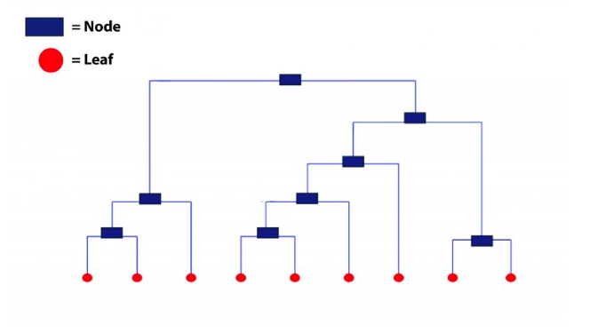
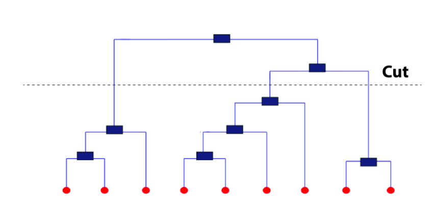

# Hierarichal Clustering  {#hierclust} 

In simple words, hierarchical clustering tries to create a sequence of nested clusters to explore deeper insights from the data. For example, this technique is being popularly used to explore the standard plant taxonomy which would classify plants by family, genus, species, and so on.

Hierarchical clustering technique is of two types:

1. **Agglomerative Clustering** – It starts with treating every observation as a cluster. Then, it merges the most similar observations into a new cluster. This process continues until all the observations are merged into one cluster. It uses a bottoms-up approach (think of an inverted tree).

2. **Divisive Clustering** – In this technique, initially all the observations are partitioned into one cluster (irrespective of their similarities). Then, the cluster splits into two sub-clusters carrying similar observations. These sub-clusters are intrinsically homogeneous. Then, we continue to split the clusters until the leaf cluster contains exactly one observation. It uses a top-down approach.


This technique creates a hierarchy (in a recursive fashion) to partition the data set into clusters. This partitioning is done in a bottoms-up fashion. This hierarchy of clusters is graphically presented using a Dendogram (shown below).


Let’s understand how to study a dendrogram.

As you know, every leaf in the dendrogram carries one observation. As we move up the leaves, the leaf observations begin to merge into nodes (carrying observations which are similar to each other). As we move further up, these nodes again merge further.

Always remember, lower the merging happens (towards the bottom of the tree), more similar the observations will be. Higher the merging happens (toward the top of the tree), less similar the observations will be.

To determine clusters, we make horizontal cuts across the branches of the dendrogram. The number of clusters is then calculated by the number of vertical lines on the dendrogram, which lies under horizontal line.



As seen above, the horizontal line cuts the dendrogram into three clusters since it surpasses three vertical lines. In a way, the selection of height to make a horizontal cut is similar to finding k in k means since it also controls the number of clusters.

But, how to decide where to cut a dendrogram? Practically, analysts do it based on their judgement and business need. More logically, there are several methods (described below) using which you can calculate the accuracy of your model based on different cuts. Finally, select the cut with a better accuracy.

The advantage of using hierarchical clustering over k means is, it doesn't require advanced knowledge of number of clusters. However, some of the advantages which k means has over hierarchical clustering are as follows:

*  It uses less memory.
*  It converges faster.
*  Unlike hierarchical, k means doesn't get trapped in mistakes made on a previous level. It improves iteratively.
*  k means is non-deterministic in nature, i.e.. after every time you initialize, it will produce different clusters. On the contrary, hierarchical clustering is deterministic.
*  Note: K means is preferred when the data is numeric. Hierarchical clustering is preferred when the data is categorical.


## Example on the Pokemon dataset  
For our first example, we are using the Pokemon dataset. It is available on the Kaggle website [here](https://www.kaggle.com/abcsds/pokemon).
Let's load the data and check what variables are there.  
```{r message=FALSE}
df <- read_csv("dataset/pokemon.csv")
glimpse(df)
```

For this example, we are just concerned with a few explanatory variables of the data set: attack, defense and speed.  
```{r}
df2 <- df %>% select(name = Name, hit_point = HP, attack = Attack, defense = Defense, 
                         sp_attack = `Sp. Atk`, sp_defense = `Sp. Def`, speed = Speed) %>%  
  as_tibble()
glimpse(df2)
```

The first step with hierarichal clustering is always to first scale the data we are dealing with.  We use the `caret` package and its `preprocess` function.  
```{r}
pokemon_preprocess <- caret::preProcess(df2, method = c("center", "scale"))
df_scaled <- predict(pokemon_preprocess, df2)
```

We can now used our standardized data on our hierarchical clustering algorithm.  
```{r}
# Create the cluster
hclust_pokemon <- hclust(dist(df_scaled), method = "complete")

# Create the plot of the cluster
plot(hclust_pokemon)
```

Although we do not see any of the terminal leaves... they all clobered together.  All the leaves at the bottom carry one observation each, which are then merged into similar values as they rise upward. We can see that there are instance four main branches.  With the `cutree` function, we can assign each observation to its specifically assigned cluster.  
```{r}
# create a df using the cutree function
df2_clust <- cutree(hclust_pokemon, k = 4)

# visual on defense vs attack 
ggplot(df2, aes(x = defense, y = attack, col = as.factor(df2_clust))) + 
  geom_point()
```

As comment on this graph of defense vs attack ability of pokemon, on can see the clustering has worked more or less well.  There are few more questions to answer with the cluster 4 - purple dot at the bottom right corner which is a pokemon with high defense and low attack abilities.  Cluster 3 is also not very clear - the turquoise one scatter all under the green and red ones.  

Using the `rect.hclust` function we can also see the height where to cut the branches.  
```{r}
plot(hclust_pokemon)
rect.hclust(hclust_pokemon, k = 4, border = "red")
```

```{r}
```

 

## Example on regressions


## References 
On the general idea of hierarchical clustering.  [Here](https://www.hackerearth.com/blog/machine-learning/practical-guide-to-clustering-algorithms-evaluation-in-r/)
