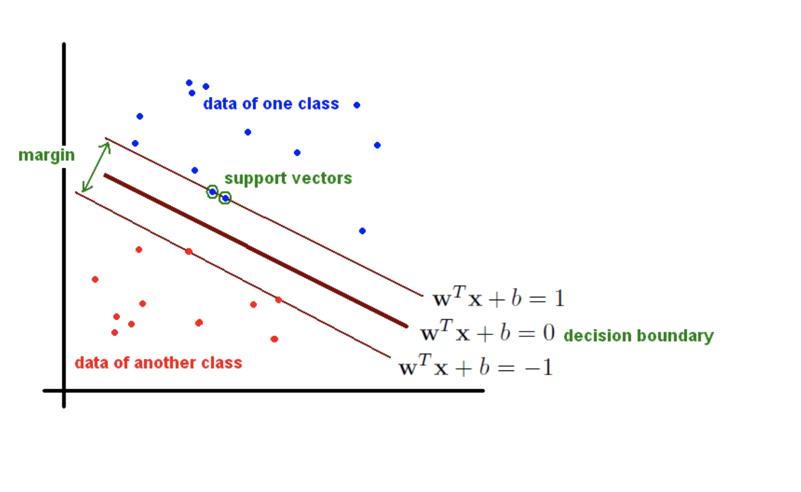
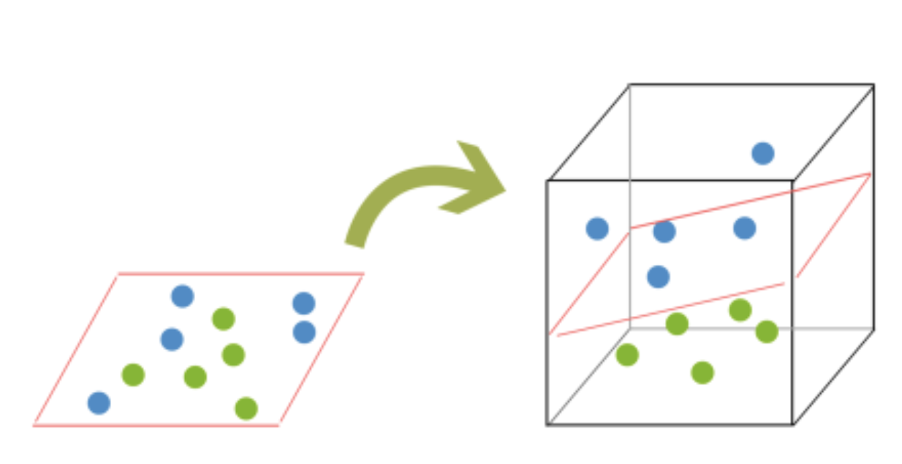

# Support Vector Machine {#svm} 




Goal: we want to find the hyperplane (i.e. decision boundary) linearly separating (or not) our classes.

Support Vector Machines (SVMs) are a particular classification strategy. SMVs work by transforming the training dataset into a higher dimension, which is then inspected for the optimal separation boundary, or boundaries, between classes. In SVMs, these boundaries are referred to as hyperplanes, which are identified by locating support vectors, or the instances that most essentially define classes, and their margins, which are the lines parallel to the hyperplane defined by the shortest distance between a hyperplane and its support vectors. Consequently, SVMs are able to classify both linear and nonlinear data.

The grand idea with SVMs is that, with a high enough number of dimensions, a hyperplane separating a particular class from all others can always be found, thereby delineating dataset member classes. When repeated a sufficient number of times, enough hyperplanes can be generated to separate all classes in n-dimensional space. Importantly, SVMs look not just for any separating hyperplane but the maximum-margin hyperplane, being that which resides equidistance from respective class support vectors.


The distance between the hyperplane and the nearest data point from either set is known as the margin. The goal is to choose a hyperplane with the greatest possible margin between the hyperplane and any point within the training set, giving a greater chance of new data being classified correctly.

Intuitively, the further from the hyperplane our data points lie, the more confident we are that they have been correctly classified. We therefore want our data points to be as far away from the hyperplane as possible, while still being on the correct side of it.


A dataset will often look more like the jumbled balls below which represent a linearly non separable dataset.  

In order to classify a dataset like the one above it’s necessary to move away from a 2d view of the data to a 3d view. Explaining this is easiest with another simplified example. Imagine that our two sets of colored balls above are sitting on a sheet and this sheet is lifted suddenly, launching the balls into the air. While the balls are up in the air, you use the sheet to separate them. This ‘lifting’ of the balls represents the mapping of data into a higher dimension. This is known as kernelling.  The commonly used kernel functions are: a) Linear, b) Polynomial, c) Sigmoid and d) Radial Basis.




Because we are now in three dimensions, our hyperplane can no longer be a line. It must now be a plane as shown in the example above. The idea is that the data will continue to be mapped into higher and higher dimensions until a hyperplane can be formed to segregate it.


## Support Vecotr Regression   
A major benefit of using SVR is that it is a non-parametric technique. Unlike SLR, whose results depend on Gauss-Markov assumptions, the output model from SVR does not depend on distributions of the underlying dependent and independent variables. Instead the SVR technique depends on kernel functions. Another advantage of SVR is that it permits for construction of a non-linear model without changing the explanatory variables, helping in better interpretation of the resultant model. The basic idea behind SVR is not to care about the prediction as long as the error (ϵi) is less than certain value. This is known as the principle of maximal margin. This idea of maximal margin allows viewing SVR as a convex optimization problem. The regression can also be penalized using a cost parameter, which becomes handy to avoid over-fit. SVR is a useful technique provides the user with high flexibility in terms of distribution of underlying variables, relationship between independent and dependent variables and the control on the penalty term.  

```{r}
library(tidyverse)
```


### Create data 
For once, let's generate some artificial data.  
```{r svm01}
x <- 1:75
set.seed(2302)
y <- cumsum(rnorm(length(x)))

df <- tibble(x = x, y = y)
glimpse(df)
```

Let's plot our data to see what we get
```{r svmplot01}
ggplot(df, aes(x = x, y = y)) + 
  geom_point(col = "blue") + 
  geom_line(linetype = "dashed") 
```

If we were going to do a regression, we'll get
```{r svm02}
model_lm <- lm(y ~ x, data = df)
prediction_lm <- tibble(y = df$y, y_hat = predict(model_lm, df))
head(prediction_lm, 10)
```

```{r svmplot02}
ggplot(df, aes(x = x, y = y)) + 
  geom_point(col = "blue") + 
  geom_line(linetype = "dashed") + 
  geom_smooth(method = "lm")
```
and we'll get a RMSE for our linear model of
```{r svm03}
prediction_lm %>% yardstick::rmse(y, y_hat)
```

Let's move onto SVM modelling.  
```{r svm04}
library(e1071)

model_svm <- svm(y ~ x, data = df)

#To plot the prediction, we need a bit of tweaking
prediction_svm <- tibble(y = df$y, y_hat = predict(model_svm, df))

df2 <- bind_cols(df, y_hat = prediction_svm$y_hat)

ggplot(df2, aes(x = x, y = y)) + 
  geom_point(col = "blue") + 
  geom_point(aes(x = x, y = y_hat), col = "red") + 
  geom_line(linetype = "dashed")
```

and we'll get a RMSE for our SVM model of
```{r svm05}
df2 %>% yardstick::rmse(y, y_hat)
```


### Tuning a SVM model 
Identifying best parameters doing a grid search. 
We'll vary epsilon between 0 and 1 by increment of 0.1 (10 values total).  We'll vary the cost from 0.5 to 8 by increment of 0.5 (15 values total).  So we'll test 150 models in total.  
```{r svm_tunedplot}
tune_model_svm <- tune(svm, y ~ x, data = df, 
                       ranges = list(epsilon = seq(0, 1, 0.1), cost = 2^(seq(0.5, 8, 0.5))))

plot(tune_model_svm)
```

```{r svm06}
print(tune_model_svm)
```


Let's even go further in our fine tuning (drilling down.. but overfitting?)
```{r svm07}
tune_model_svm2 <- tune(svm, y~x, data = df, 
                        ranges = list(epsilon = seq(tune_model_svm$best.model$epsilon-.15, 
                                                    tune_model_svm$best.model$epsilon+.15, 0.01), 
                                      cost = seq(2^(log2(tune_model_svm$best.model$cost)-1), 
                                                 2^(log2(tune_model_svm$best.model$cost)+1), length = 6)))

print(tune_model_svm2)
```

We now use this parameters for prefiction.  !!! Overfitting is possible here. 
```{r svm08}
model_svm_tuned <- predict(tune_model_svm2$best.model, data = df)

#To plot the prediction, we need a bit of tweaking
prediction_svm_tuned <- tibble(y = df$y, y_hat = predict(tune_model_svm2$best.model, df))

df3 <- bind_cols(df2, y_hat_tuned = prediction_svm_tuned$y_hat)

ggplot(df3, aes(x = x, y = y)) + 
  geom_point(col = "blue") + 
  geom_point(aes(x = x, y = y_hat), col = "red") + 
  geom_point(aes(x = x, y = y_hat_tuned), col = "green") + 
  geom_line(linetype = "dashed")
```


### Discussion on parameters

The gamma parameter in the RBF kernel determines the reach of a single training instance. If the value of Gamma is low, then every training instance will have a far reach. Conversely, high values of gamma mean that training instances will have a close reach. So, with a high value of gamma, the SVM decision boundary will simply be dependent on just the points that are closest to the decision boundary, effectively ignoring points that are farther away. In comparison, a low value of gamma will result in a decision boundary that will consider points that are further from it. As a result, high values of gamma typically produce highly flexed decision boundaries, and low values of gamma often results in a decision boundary that is more linear.

http://scikit-learn.org/stable/modules/svm.html

https://www.youtube.com/watch?v=m2a2K4lprQw

http://haohanw.blogspot.com/2014/03/ml-how-sigma-matters-in-svm-rbf-kernel.html

https://link.springer.com/protocol/10.1007/978-1-60327-241-4_13


## References  

Intro from [kdnugget](https://www.kdnuggets.com/2016/09/support-vector-machines-concise-technical-overview.html)
The R code with the creating data part is from a [RPUB document](https://rpubs.com/richkt/280840) and the [fine tuning](https://www.svm-tutorial.com/2014/10/support-vector-regression-r/) and using it for further prediction
