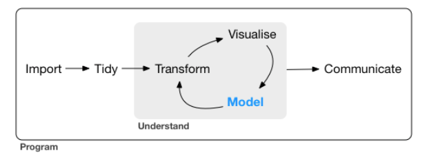

# Case Study - Mushrooms Classification  {#mushroom}

This example demonstrates how to classify muhsrooms as edible or not.  It also answer the question: what are the main characteristics of an edible mushroom?

[This blog post](https://stoltzmaniac.com/random-forest-classification-of-mushrooms/) gave us first the idea and we followed most of it.  We also noticed that Kaggle has put online the same data set and classification exercise.  We have taken inspiration from some posts [here](https://www.kaggle.com/abhishekheads/d/uciml/mushroom-classification/walk-through-of-different-classification-models) and [here](https://www.kaggle.com/jhuno137/d/uciml/mushroom-classification/classification-tree-using-rpart-100-accuracy)

The data set is available on the [Machine Learning Repository](http://archive.ics.uci.edu/ml/datasets/Mushroom) of the UC Irvine website.  


## Import the data  
The data set is given to us in a rough form and quite a bit of editing is necessary.  
```{r message=FALSE}
# Load the data - we downloaded the data from the website and saved it into a .csv file
library(tidyverse)
mushroom <- read_csv("dataset/Mushroom.csv", col_names = FALSE) 
glimpse(mushroom)
```

Basically we have `r nrow(mushroom)` mushrooms in the dataset.  And each observation consists of `r ncol(mushroom)` variables.  As it stands, the data frame doesn't look very meaningfull.  We have to go back to the source to bring meaning to each of the variables and to the various levels of the categorical variables.  

##  Tidy the data   
This is the least fun part of the workflow.  
We'll start by giving names to each of the variables, then we specify the category for each variable. 
It is not necessary to do so but it does add meaning to what we do.   

```{r message=FALSE}
# Rename the variables
colnames(mushroom) <- c("edibility", "cap_shape", "cap_surface", 
                        "cap_color", "bruises", "odor", 
                        "gill_attachement", "gill_spacing", "gill_size", 
                        "gill_color", "stalk_shape", "stalk_root", 
                        "stalk_surface_above_ring", "stalk_surface_below_ring", "stalk_color_above_ring", 
                        "stalk_color_below_ring", "veil_type", "veil_color", 
                        "ring_number", "ring_type", "spore_print_color", 
                        "population", "habitat")

# Defining the levels for the categorical variables 
## We make each variable as a factor
mushroom <- mushroom %>% map_df(function(.x) as.factor(.x))

## We redefine each of the category for each of the variables
levels(mushroom$edibility) <- c("edible", "poisonous")
levels(mushroom$cap_shape) <- c("bell", "conical", "flat", "knobbed", "sunken", "convex")
levels(mushroom$cap_color) <- c("buff", "cinnamon", "red", "gray", "brown", "pink", 
                                "green", "purple", "white", "yellow")
levels(mushroom$cap_surface) <- c("fibrous", "grooves", "scaly", "smooth")
levels(mushroom$bruises) <- c("no", "yes")
levels(mushroom$odor) <- c("almond", "creosote", "foul", "anise", "musty", "none", "pungent", "spicy", "fishy")
levels(mushroom$gill_attachement) <- c("attached", "free")
levels(mushroom$gill_spacing) <- c("close", "crowded")
levels(mushroom$gill_size) <- c("broad", "narrow")
levels(mushroom$gill_color) <- c("buff", "red", "gray", "chocolate", "black", "brown", "orange", 
                                 "pink", "green", "purple", "white", "yellow")
levels(mushroom$stalk_shape) <- c("enlarging", "tapering")
levels(mushroom$stalk_root) <- c("missing", "bulbous", "club", "equal", "rooted")
levels(mushroom$stalk_surface_above_ring) <- c("fibrous", "silky", "smooth", "scaly")
levels(mushroom$stalk_surface_below_ring) <- c("fibrous", "silky", "smooth", "scaly")
levels(mushroom$stalk_color_above_ring) <- c("buff", "cinnamon", "red", "gray", "brown", "pink", 
                                "green", "purple", "white", "yellow")
levels(mushroom$stalk_color_below_ring) <- c("buff", "cinnamon", "red", "gray", "brown", "pink", 
                                "green", "purple", "white", "yellow")
levels(mushroom$veil_type) <- "partial"
levels(mushroom$veil_color) <- c("brown", "orange", "white", "yellow")
levels(mushroom$ring_number) <- c("none", "one", "two")
levels(mushroom$ring_type) <- c("evanescent", "flaring", "large", "none", "pendant")
levels(mushroom$spore_print_color) <- c("buff", "chocolate", "black", "brown", "orange", 
                                        "green", "purple", "white", "yellow")
levels(mushroom$population) <- c("abundant", "clustered", "numerous", "scattered", "several", "solitary")
levels(mushroom$habitat) <- c("wood", "grasses", "leaves", "meadows", "paths", "urban", "waste")
```

Let's check our changes one last time before diving into in the next phase of our data analysis workflow.  
```{r}
glimpse(mushroom)
```

As each variables is categorical, let's see how many categories are we speaking about?
```{r}
number_class <- function(x){
  x <- length(levels(x))
}

x <- mushroom %>% map_dbl(function(.x) number_class(.x)) %>% as_tibble() %>% 
       rownames_to_column() %>% arrange(desc(value))
colnames(x) <- c("Variable name", "Number of levels")
print(x)
```


## Understand the data   
This is the circular phase of our dealing with data.  This is where each of the transforming, visualizing and modeling stage reinforce each other to create a better understanding.  


### Transform the data
We noticed from the previous section an issue with the veil_type variable.  It has only one factor.  So basically, it does not bring any information.  Furthermore, factor variable with only one level do create issues later on at the modeling stage.  R will throw out an error for the categorical variable that has only one level.  
So let's take away that column.   
```{r}
mushroom <- mushroom %>% select(- veil_type)
```

Do we have any missing data?  Most ML algorithms won't work if we have missing data. 
```{r}
map_dbl(mushroom, function(.x) {sum(is.na(.x))})
```

Lucky us!  We have no missing data.  

### Visualize the data  
This is one of the most important step in the DS process.  This stage can gives us unexpected insights and often allows us to ask the right questions.    
```{r mushroom_pic1, message=FALSE}
library(ggplot2)
ggplot(mushroom, aes(x = cap_surface, y = cap_color, col = edibility)) + 
  geom_jitter(alpha = 0.5) + 
  scale_color_manual(breaks = c("edible", "poisonous"), 
                     values = c("green", "red"))
```

If we want to stay safe, better bet on *fibrous* surface.  Stay especially away from *smooth* surface, except if they are purple or green.  

```{r mushroom_pic2}
ggplot(mushroom, aes(x = cap_shape, y = cap_color, col = edibility)) + 
  geom_jitter(alpha = 0.5) + 
  scale_color_manual(breaks = c("edible", "poisonous"), 
                     values = c("green", "red"))
```

Again, in case one don't know about mushroom, it is better to stay away from all shapes except maybe for *bell* shape mushrooms.  

```{r mushroom_pic3}
ggplot(mushroom, aes(x = gill_color, y = cap_color, col = edibility)) + 
  geom_jitter(alpha = 0.5) + 
  scale_color_manual(breaks = c("edible", "poisonous"), 
                     values = c("green", "red"))

ggplot(mushroom, aes(x = edibility, y = odor, col = edibility)) + 
  geom_jitter(alpha = 0.5) + 
  scale_color_manual(breaks = c("edible", "poisonous"), 
                     values = c("green", "red"))
```

Odor is defintely quite an informative predictor.  Basically, if it smells *fishy*, *spicy* or *pungent* just stay away.  If it smells like *anise* or *almond* you can go ahead.  If it doesn't smell anything, you have better chance that it is edible than not.  


TO DO: put a comment on what we see
TO DO: put a mosaic graph


### Modeling 
At this stage, we should have gathered enough information and insights on our data to choose appropriate modeling techniques.  

Before we go ahead, we need to split the data into a training and testing set
```{r mush01}
set.seed(1810)
mushsample <- caret::createDataPartition(y = mushroom$edibility, times = 1, p = 0.8, list = FALSE)
train_mushroom <- mushroom[mushsample, ]
test_mushroom <- mushroom[-mushsample, ]
```

We can check the quality of the splits in regards to our predicted (dependent) variable.  
```{r mush02}
round(prop.table(table(mushroom$edibility)), 2)
round(prop.table(table(train_mushroom$edibility)), 2)
round(prop.table(table(test_mushroom$edibility)), 2)
```
It seems like we have the right splits.  


#### Use of Regression Tree  
As we have many categorical variables, regression tree is an ideal classification tools for such situation.  
We'll use the `rpart` package.  Let's give it a try without any customization.  
```{r mush03}
library(rpart)
library(rpart.plot)
set.seed(1810)
model_tree <- rpart(edibility ~ ., data = train_mushroom, method = "class")
model_tree

```

```{r mush04}
caret::confusionMatrix(data=predict(model_tree, type = "class"), 
                       reference = train_mushroom$edibility, 
                       positive="edible")
```

We have quite an issue here. 40 mushrooms have been predicted as edible but were actually poisonous. That should not be happening. So we'll set up a penalty for wrongly predicting a mushroom as `edible` when in reality it is `poisonous`. A mistake the other way is not as bad. At worst we miss on a good recipe! So let's redo our tree with a penalty for wrongly predicting poisonous. To do this, we introduce a penalty matrix that we'll use as a parameter in our rpart function.   
```{r mush05}
penalty_matrix <- matrix(c(0, 1, 10, 0), byrow = TRUE, nrow = 2)
model_tree_penalty <- rpart(edibility ~ ., data = train_mushroom, method = "class", 
                    parms = list(loss = penalty_matrix))

caret::confusionMatrix(data=predict(model_tree_penalty, type = "class"), 
                       reference = train_mushroom$edibility, 
                       positive="edible")
```

So introducing a penalty did the job; it gave us a perfect prediction and saves us from a jounrey at the hospital.  

Another way to increase the accuracy of our tree model is to play on the `cp` parameter.  
We start to build a tree with a very low `cp` (that is we'll have a deep tree).  The idea is that we then prune it later.  
```{r mush06}
model_tree <- rpart(edibility ~ ., data = train_mushroom, 
                    method = "class", cp = 0.00001)
```

To prune a tree, we first have to find the `cp` that gives the lowest `xerror` or cross-validation error.  We can find the lowest `xerror` using either the `printcp` or `plotcp` function.   
```{r}
printcp(model_tree)
```

We can see here that that the lowest `xerror` happen at the 5th split. 

```{r mushroom_xvalplot1}
plotcp(model_tree)
```

```{r}
model_tree$cptable[which.min(model_tree$cptable[, "xerror"]), "CP"]
```

So now we can start pruning our tree with the `cp` that gives the lowest cross-validation error.  
```{r}
bestcp <- round(model_tree$cptable[which.min(model_tree$cptable[, "xerror"]), "CP"], 4)
model_tree_pruned <- prune(model_tree, cp = bestcp)
```


Let's have a quick look at the tree as it stands
```{r mushroom_treeplot1}
rpart.plot(model_tree_pruned, extra = 104, box.palette = "GnBu", 
           branch.lty = 3, shadow.col = "gray", nn = TRUE)
```

How does the model perform on the train data?
```{r}
#table(train_mushroom$edibility, predict(model_tree, type="class"))

caret::confusionMatrix(data=predict(model_tree_pruned, type = "class"), 
                       reference = train_mushroom$edibility, 
                       positive="edible")
```
It seems like we have a perfect accuracy on our training set.   It is quite rare to have such perfect accuracy.    

Let's check how it fares on the testing set.   
```{r}
test_tree <- predict(model_tree, newdata = test_mushroom)
caret::confusionMatrix(data = predict(model_tree, newdata = test_mushroom, type = "class"), 
                       reference = test_mushroom$edibility, 
                       positive = "edible")
```
Perfect prediction here as well.  


#### Use of Random Forest   
We usually use random forest if a tree is not enough.  In this case, as we have perfect prediction using a single tree, it is not really necessary to use a Random Forest algorithm.  We just use for learning sake without tuning any of the parameters.  

```{r rf_errorplot1, message=FALSE}
library(randomForest)
model_rf <- randomForest(edibility ~ ., ntree = 50, data = train_mushroom)
plot(model_rf)
```

The default number of trees for the random forest is 500; we just use 50 here.   As we can see on the plot, above 20 trees, the error isn't decreasing anymore.  And actually, the error seems to be 0 or almost 0.  
The next step can tell us this more accurately.  

```{r}
print(model_rf)
```

Altough it is not really necessary to this here as we have a perfect prediction, we can use the `confusionMatrix` function from the `caret` pacakge.  
```{r}
caret::confusionMatrix(data = model_rf$predicted, reference = train_mushroom$edibility , 
                       positive = "edible")
```


If we want to look at the most important variable in terms of predicting edibility in our model, we can do that using the *Mean Decreasing Gini* 
```{r rf_importance_variable}
varImpPlot(model_rf, sort = TRUE, 
           n.var = 10, main = "The 10 variables with the most predictive power")
```

Another way to look at the predictible power of the variables is to use the `importance` extractor function.  
```{r}
library(tibble)
importance(model_rf) %>% data.frame() %>% 
  rownames_to_column(var = "Variable") %>% 
  arrange(desc(MeanDecreaseGini)) %>% 
  head(10)
```

We could compare that with the important variables from the classification tree obtained above.  
```{r}
model_tree_penalty$variable.importance %>% 
  as_tibble() %>% rownames_to_column(var = "variable") %>% 
  arrange(desc(value)) %>% head(10)
```

Interestingly gill_size which is the 5th most important predictor in the random forest does not appear in the top 10 of our classification tree.  

Now we apply our model to our testing set.  
```{r}
test_rf <- predict(model_rf, newdata = test_mushroom)

# Quick check on our prediction
table(test_rf, test_mushroom$edibility)

```

Perfect Prediction!  

#### Use of SVM  
```{r warning=FALSE, message=FALSE}
library(e1071)
model_svm <- svm(edibility ~. , data=train_mushroom, cost = 1000, gamma = 0.01)
```


Check the prediction
```{r}
test_svm <- predict(model_svm, newdata = test_mushroom)

table(test_svm, test_mushroom$edibility)
```

And perfect prediction again! 

## Communication
With some fine tuning, a regression tree managed to predict accurately the edibility of mushroom.  They were 2 parameters to look at: the `cp`and the penalty matrix. 
Random Forest and SVM achieved similar results out of the box.  
The regression tree approach has to be prefered as it is a lot easier to grasp the results from a tree than from a SVM algorithm.  

For sure I will take my little tree picture next time I go shrooming.  That said, I will still only go with a good mycologist.  

